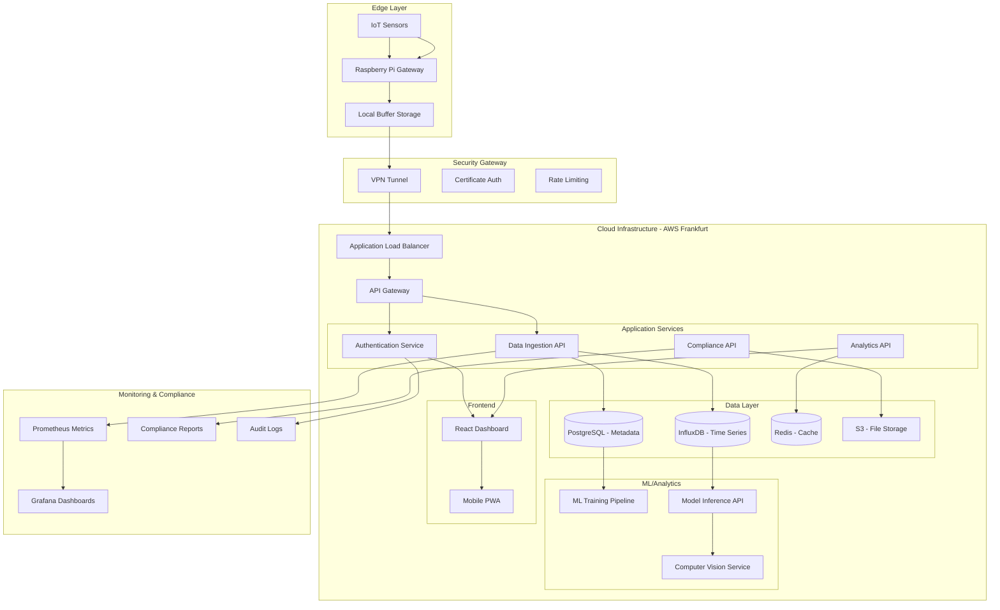

# 🌿 Data4Plants

> Smart Cannabis Cultivation Analytics for the European Market

Data4Plants is an IoT-powered analytics platform specifically designed for medical and industrial cannabis cultivation in Europe. We combine real-time environmental monitoring, machine learning predictions, and automated compliance reporting to help licensed producers optimize yield, ensure quality, and maintain regulatory compliance.

## 🎯 Mission

Transform small and medium cannabis producers in Europe through intelligent data analytics, reducing crop losses, maximizing cannabinoid potency, and automating compliance with EU regulations.

## 🚀 Key Features

### Real-Time Monitoring
- **Environmental Sensors**: pH, EC, temperature, humidity, light spectrum (PPFD)
- **IoT Integration**: Raspberry Pi-based gateway with MQTT protocol
- **24/7 Surveillance**: Continuous data collection with local buffering
- **Mobile Access**: PWA for on-the-go monitoring

### Machine Learning Intelligence
- **Predictive Analytics**: Early detection of nutrient deficiencies, pests, and diseases
- **Yield Optimization**: ML models for maximizing THC/CBD production
- **Quality Assurance**: Computer vision for plant health assessment
- **Growth Forecasting**: Harvest timing and quantity predictions

### Compliance Automation
- **EU Regulatory Support**: Automated reporting for EU-GMP, GACP standards
- **Seed-to-Sale Tracking**: Complete traceability with QR codes
- **Documentation Generation**: PDF reports for regulatory inspections
- **GDPR Compliant**: European data protection standards

### Professional Dashboard
- **Real-Time Visualizations**: Live charts and environmental metrics
- **Cannabinoid Tracking**: THC/CBD progression throughout growth cycle
- **Alert System**: Instant notifications for critical parameters
- **Historical Analysis**: Growth pattern insights and batch comparisons

## 🏗️ Technical Architecture

Our enterprise-grade architecture is designed for scalability, security, and regulatory compliance in the cannabis industry.

### System Overview

### Architecture Layers

#### 1. **Edge Computing Layer**
- **Raspberry Pi Gateways**: Local data processing and buffering
- **Sensor Network**: Environmental monitoring with redundancy
- **Offline Capability**: 72-hour local data storage during connectivity issues
- **OTA Updates**: Secure firmware updates with rollback capability

#### 2. **Security & Networking**
- **VPN Tunneling**: Site-to-site encrypted connections
- **mTLS Authentication**: Mutual certificate-based device authentication
- **API Security**: OAuth 2.0 + JWT with refresh token rotation
- **Network Segmentation**: Isolated environments for different clients

#### 3. **Cloud Infrastructure (AWS Frankfurt)**
- **Auto-Scaling**: Elastic compute based on demand
- **High Availability**: Multi-AZ deployment with 99.9% SLA
- **Disaster Recovery**: Automated backups with 4-hour RTO
- **GDPR Compliance**: EU data residency and privacy controls

#### 4. **Data Architecture**
- **Stream Processing**: Real-time data ingestion with Apache Kafka
- **Time-Series Optimization**: InfluxDB for sensor data with 1-second resolution
- **Metadata Management**: PostgreSQL for configuration and user data
- **Caching Strategy**: Redis for sub-100ms response times

#### 5. **Machine Learning Pipeline**
- **Model Training**: Automated retraining with new data
- **A/B Testing**: Model version comparison and gradual rollout
- **Feature Store**: Centralized feature management for ML models
- **Model Monitoring**: Performance drift detection and alerts

### Data Flow Architecture

1. **Collection**: Sensors → Pi Gateway → Local Buffer
2. **Transmission**: Encrypted upload → API Gateway → Validation
3. **Storage**: Time-series DB + Metadata DB + File Storage
4. **Processing**: ML Pipeline → Model Inference → Predictions
5. **Delivery**: REST API → Dashboard → Mobile App
6. **Compliance**: Audit logs → Regulatory reports → Secure archive

### Security Implementation

- **Encryption**: AES-256 at rest, TLS 1.3 in transit
- **Access Control**: RBAC with principle of least privilege
- **Compliance**: SOC 2 Type II, GDPR Article 32 technical measures
- **Monitoring**: 24/7 security event correlation and response

## 🛠️ Tech Stack

### Frontend
- **Framework**: React 18 + Next.js 14
- **Language**: TypeScript
- **Styling**: Tailwind CSS + shadcn/ui
- **Charts**: Recharts
- **PWA**: Progressive Web App support

### Backend
- **API**: Node.js + Express
- **Database**: PostgreSQL + InfluxDB (time-series)
- **Cache**: Redis
- **Authentication**: JWT + API keys

### IoT & Hardware
- **Gateway**: Raspberry Pi 4
- **Sensors**: pH, EC, DHT22, light sensors
- **Communication**: WiFi + MQTT
- **Updates**: OTA (Over-The-Air) capability

### Machine Learning
- **Training**: Python + scikit-learn
- **Computer Vision**: TensorFlow
- **Deployment**: FastAPI + Docker
- **Pipeline**: Apache Airflow (planned)

### DevOps & Security
- **Cloud**: AWS (Frankfurt region)
- **CI/CD**: GitHub Actions
- **Security**: TLS 1.3, X.509 certificates, GDPR compliance
- **Monitoring**: Prometheus + Grafana

## 📊 Target Market

### Primary Market: European Cannabis Producers
- **Geography**: Greece, Italy, Netherlands, Germany
- **Size**: Small to medium licensed operations (10-100 plants)
- **Revenue**: €50K-500K annual cultivation revenue
- **Pain Points**: Manual compliance, inconsistent quality, crop losses

### Market Opportunity
- **Cannabis Market Size**: €7.5B+ in Europe by 2025
- **TAM**: 2,000+ licensed producers across EU
- **SAM**: 500+ small-medium producers in target countries
- **SOM**: 50+ early adopters (target for year 1)

## 💰 Business Model

### SaaS Subscription Tiers
- **Starter**: €99/month - Basic monitoring + compliance
- **Professional**: €199/month - ML insights + multi-location
- **Enterprise**: €399/month - Custom integrations + priority support

### Additional Revenue Streams
- IoT hardware sales (€800-1200 per kit)
- Implementation consulting
- Custom ML model development

## 📈 MVP Roadmap

### Phase 1: Foundation (Month 1-2)
- [ ] Core API development
- [ ] Basic dashboard with mock data
- [ ] IoT prototype (sensors + Raspberry Pi)
- [ ] User authentication & security

### Phase 2: Integration (Month 2-3)
- [ ] Real sensor data integration
- [ ] Time-series database setup
- [ ] Mobile PWA development
- [ ] Basic alerting system

### Phase 3: Intelligence (Month 3-4)
- [ ] First ML model (problem detection)
- [ ] Computer vision for plant health
- [ ] Compliance reporting module
- [ ] Beta testing with 3-5 producers

## 🎯 Success Metrics

### Technical KPIs
- **Uptime**: 99.5%+ system availability
- **Data Accuracy**: <2% sensor reading variance
- **Response Time**: <200ms API response time
- **ML Accuracy**: >85% problem detection rate

### Business KPIs
- **User Adoption**: 20 active producers by month 4
- **Engagement**: Daily dashboard usage >80%
- **Retention**: 90% month-over-month retention
- **ROI**: 15%+ average yield improvement for users

## 🔒 Security & Compliance

### Data Protection
- **GDPR Compliant**: European data protection standards
- **Encryption**: AES-256 at rest, TLS 1.3 in transit
- **Access Control**: Role-based permissions
- **Audit Logs**: Complete activity tracking

### Cannabis Compliance
- **Regulatory Standards**: EU-GMP, GACP compliance
- **Traceability**: Seed-to-sale tracking
- **Documentation**: Automated regulatory reporting
- **Certifications**: CE marking for hardware

## 🌍 Market Entry Strategy

### Go-to-Market Approach
1. **Direct Outreach**: Personal connections in Greece/Italy
2. **Pilot Programs**: Free 3-month trials for early adopters
3. **Conference Presence**: Cannabis industry events in Europe
4. **Digital Marketing**: LinkedIn ads targeting licensed producers
5. **Partnership Channel**: Integration with existing cannabis software

### Competitive Advantages
- **Cannabis Specialization**: Purpose-built for cannabis vs. generic AgTech
- **European Focus**: Local compliance, GDPR-ready, EU hosting
- **Technical Depth**: ML/AI expertise with security background
- **Cost Efficiency**: Brazilian development costs, European pricing

## 🚀 Getting Started

### For Cannabis Producers
Interested in optimizing your cultivation with smart analytics?

📧 **Contact**: davidgomes@tuta.io 

## 📝 License

This project is licensed under the MIT License - see the [LICENSE](LICENSE) file for details.

## ⚖️ Legal Disclaimer

Data4Plants provides technology solutions exclusively for licensed medical and industrial cannabis operations in jurisdictions where such activities are legal. We do not support or facilitate illegal cannabis activities.

---

**Made with ❤️ for the future of sustainable cannabis cultivation**

*Transforming data into extraordinary harvests* 🌱
